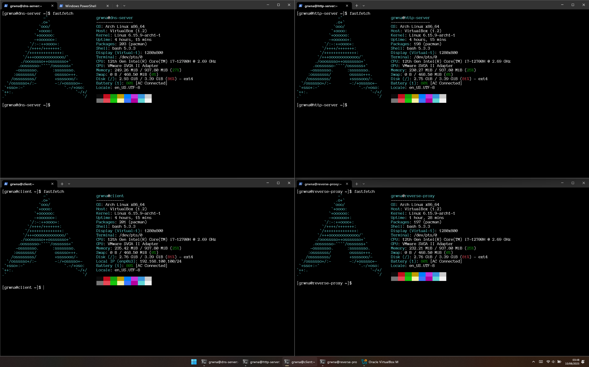

# DNS - DeeezN~~udd~~S 💔😩

Setup jaringan sederhana yang memiliki DNS server, HTTP server, dan reverse proxy untuk menyediakan webpage ke sebuah client, diimplementasikan menggunakan 4 Virtual Machine.

<br>

## Author
| Nama              | NIM      |
| ----------------- | -------- |
| M. Rayhan Farrukh | 13523035 |

<br>

## Tabel Spesifikasi
| Spesifikasi                 | Sifat | Status |
| --------------------------- | ----- | ------ |
| Setup jaringan dengan 4 VM  | Wajib | ✅ |
| DHCP server                 | Bonus | ✅ |
| Firewall pada reverse proxy | Bonus | ✅ |
| OS CLI-only                 | Bonus | ✅ |

**Link Video:** 

<br>

## Penjelasan 
### Repository
*Repository* ini digunakan sebagai tempat menyimpan konfigurasi untuk *setup* jaringan, sekaligus sebagai panduan singkat untuk mereproduksinya. Setiap *directory* mensimulasikan *home directory* user utama masing-masing VM, kecuali untuk folder `config`. Folder `config` menyimpan file konfigurasi (misal `.conf`) yang diperlukan oleh VM, letak sebenarnya dituliskan pada README masing-masing VM, bersama dengan **konfigurasi lengkap** dari VM tersebut. 

<br>

### Operating System
 Proyek ini diimplementasikan menggunakan 4 VM sebagai masing-masing *device* pada jaringan. Setiap VM menggunakan OS Arch Linux yang diinstal menggunakan `archinstall` dengan profil minimal. Konfigurasi lengkap `archinstall` dapat dilihat pada file `archinstall_configuration.json`.

<br>

### Virtual Machine
Untuk mempermudah *setup* VM, saya mengisntall OS pada satu VM, kemudian membuat *linked clone* untuk 3 VM lainnya. VM dialokasikan 1 GB RAM (namun penggunaan RAM tidak pernah melebihi 300 MB), 1 *core* CPU dan 4 GB *disk space*. Pada akhirnya, semua VM ini secara total hanya menggunakan 4 GB *disk space* (karena menggunakan *linked clone*). 

Selain itu, setiap VM menggunakan 3 jenis *Network Adapter*. 
- *Internal Network*. Sebagai bagian dari spesifikasi agar VM dapat terhubung satu sama lain.
- *Host-only*. Untuk memungkinkan SSH, mempermudah proses *development*
- NAT. Agar VM terhubung ke internet, untuk mengunduh *package* atau hal-hal lain yang diperlukan.

>[!note]
>*Adapter* NAT akan dimatikan setelah proses *development* selesai agar VM tidak terhubung ke internet.

<br>

### Konfigurasi *Pre-Clone*
Konfigurasi/*Command* yang digunakan pada VM sebelum di-*clone* (artinya ini berlaku untuk semua VM)
```
    sudo pacman -S openssh
    sudo pacman -S vim
    sudo pacman -S fastfetch
```
<br>

### *Development*
*Development* dilakukan pada Windows sebagai *host* OS dan menggunakan PowerShell untuk terhubung ke masing-masing VM melalui SSH menggunakan alamat dari *Host-only adapter*. Konfigurasi untuk SSH ada di `sshd_config`

