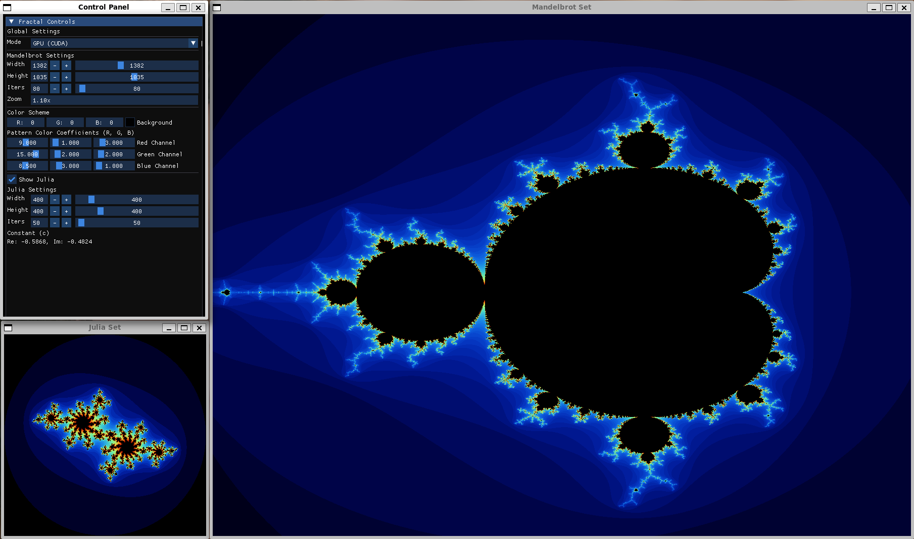
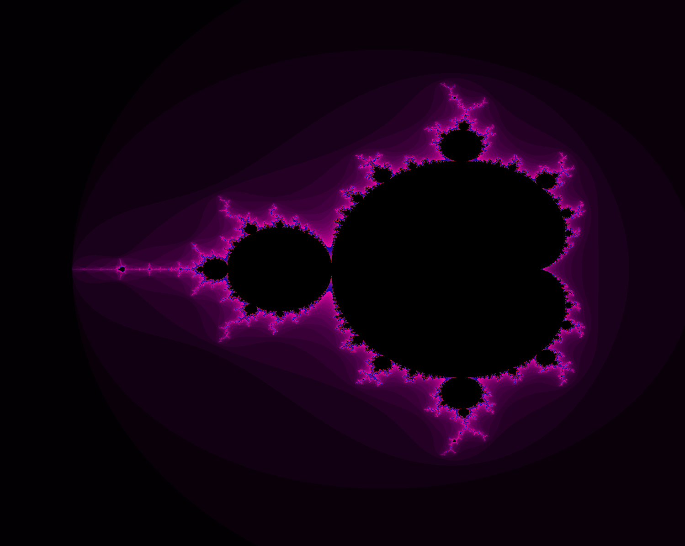
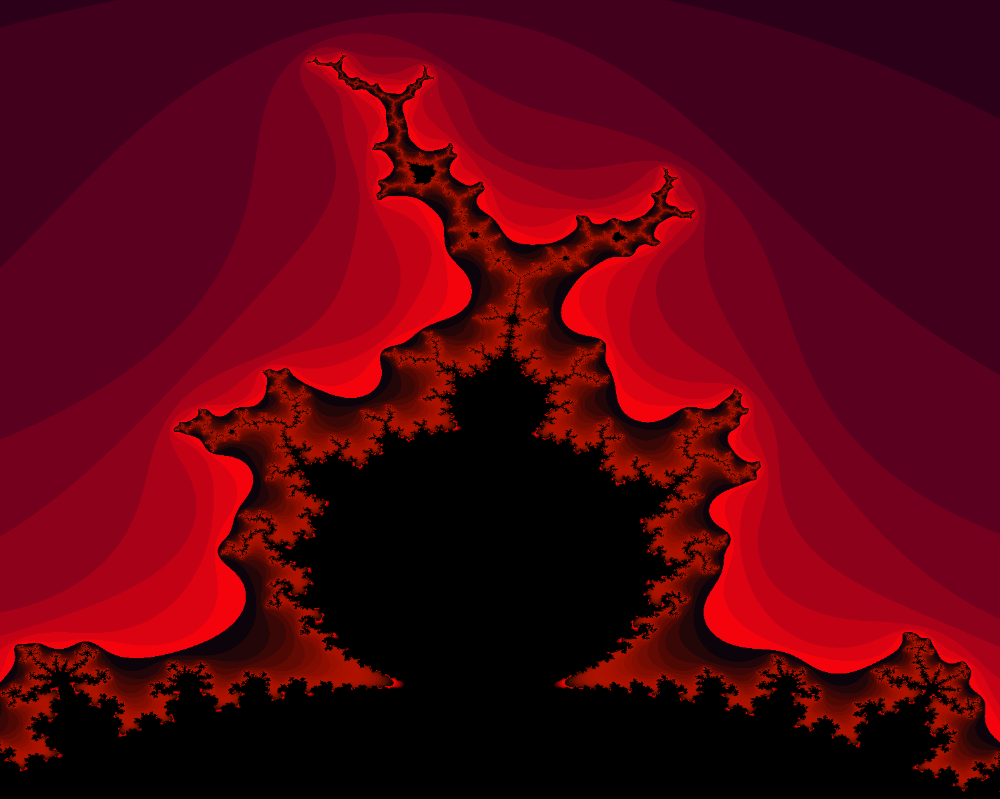
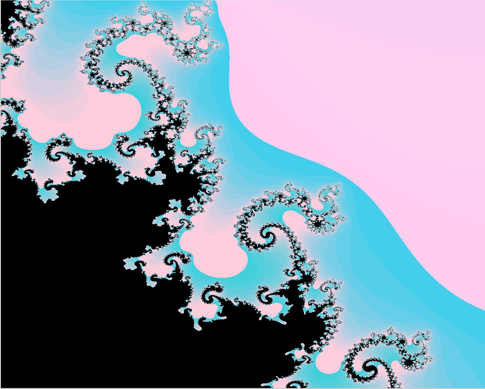
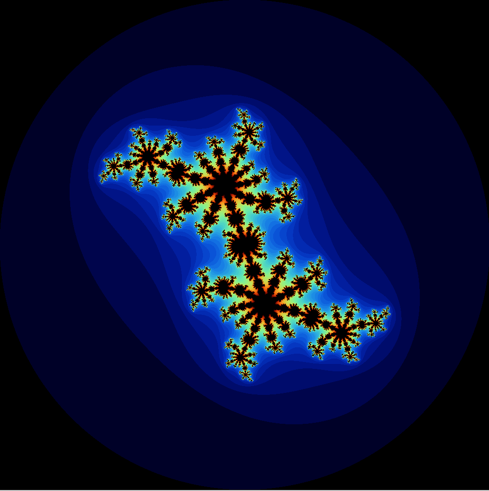
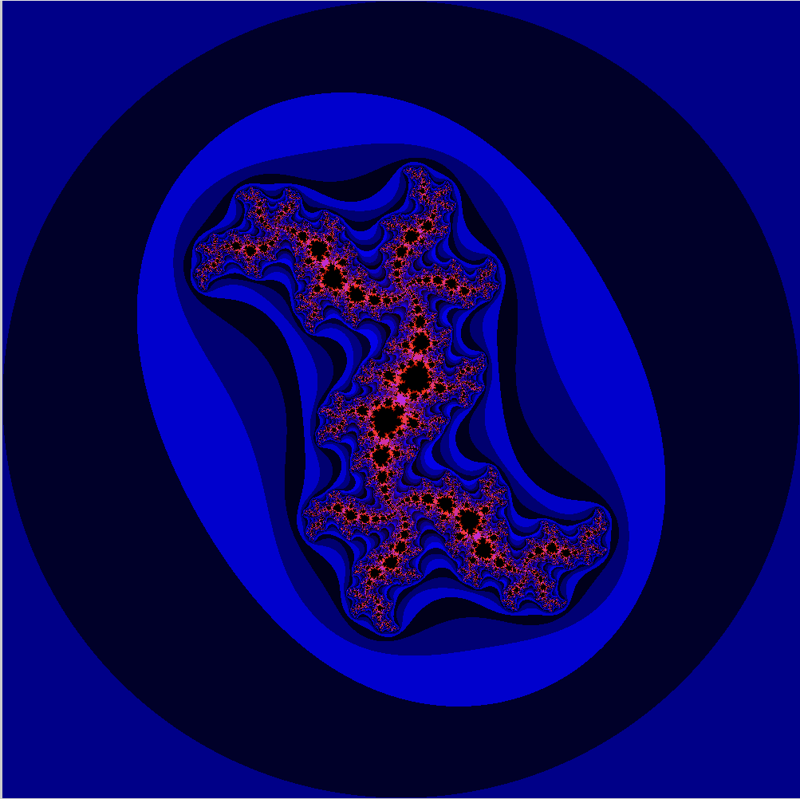
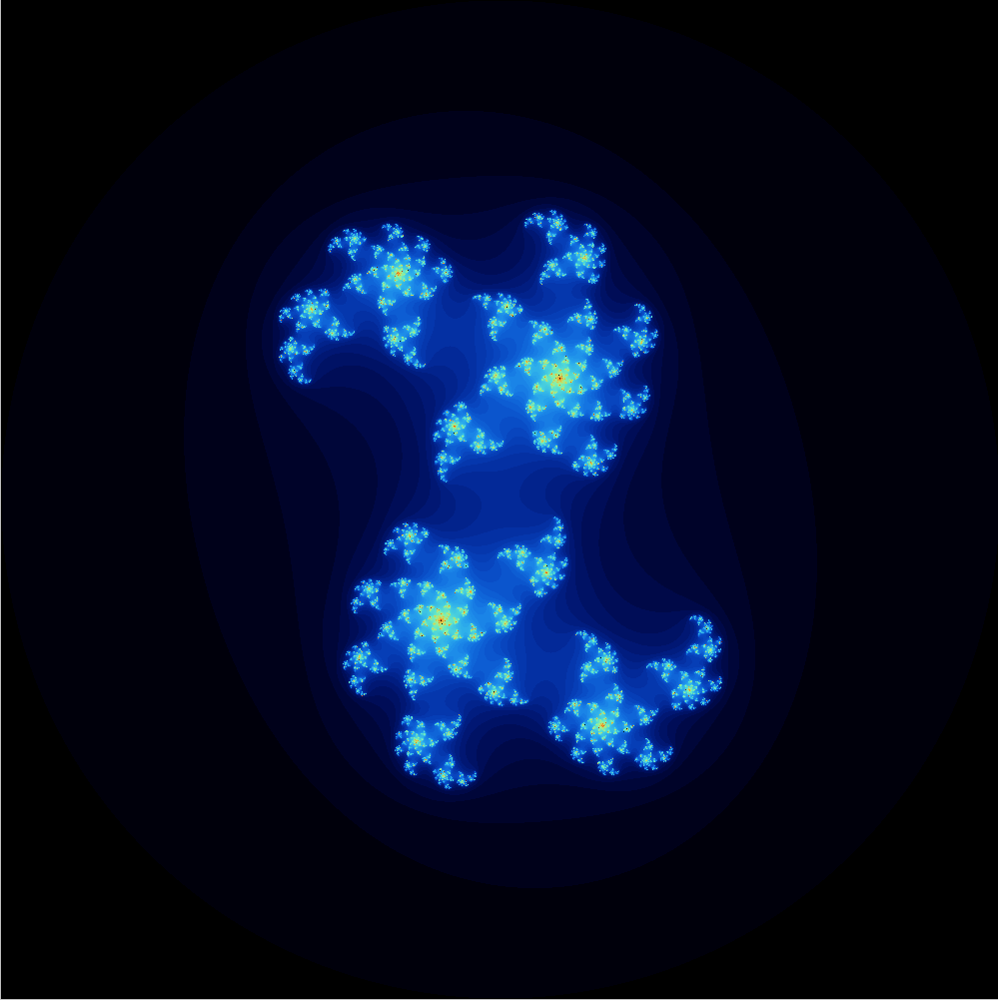

# Mandelbrot of Madness

## Mandelbrot Set Generator with CPU & GPU Acceleration



Proyek ini di buat sebagai salah satu tugas seleksi asisten Laboratorium Sistem Terdistribusi. Program dapat menghasilkan gambar himpunan Mandelbrot dalam bentuk `.bmp` menggunakan  tiga jenis implementasi: serial, paralel CPU dengan OpenMP, dan akselerasi GPU menggunakan CUDA. Program ini ditulis dalam bahasa C++

<br>

## Author
| Nama              | NIM      |
| ----------------- | -------- |
| M. Rayhan Farrukh | 13523035 |

<br>

## Tabel Spesifikasi
| Spesifikasi          | Sifat | Status |
| -------------------- | ----- | ------ |
| Implementasi Serial  | Wajib | ✅ |
| Paralel CPU          | Wajib | ✅ |
| Akselerasi GPU       | Bonus | ✅ |
| GUI Sederhana        | Bonus | ✅ |
| Himpunan Julia       | Bonus | ✅ |
| Kapabilitas Zoom & Pan     | Bonus | ✅ |

<br>

## 📑 Daftar Isi
- [Fitur](#fitur)
- [Deskripsi Implementasi](#deskripsi-implementasi)
    - [Serial](#serial)
    - [CPU](#paralel-cpu-(openmp))
    - [GPU](#akselerasi-gpu-(cuda))
    - [CLI](#cli)
    - [GUI](#gui)
- [Petunjuk Kompilasi & Menjalankan](#petunjuk-kompilasi-&-menjalanka)
    - [*Prerequisite*](#prerequisite)
    - [Langkah Kompilasi](#kompilasi)
    - [Menjalankan Program](#menjalankan-program)
- [Testing](#testing)
    - [Video Demo](#video-demo)
    - [Contoh Hasil Gambar](#contoh-hasil-gambar)
    - [Hasil Benchmarking](#hasil-benchmarking)
    

<br>


## 📝Deskripsi Implementasi

Berikut adalah penjelasan singkat untuk setiap pendekatan yang digunakan dalam proyek ini.
### 🐌Serial

Implementasi *basic* di mana setiap piksel  gambar dihitung secara berurutan satu per satu oleh satu thread CPU. Bagian ini acuan untuk mengukur percepatan yang didapat dari metode paralel.
### 🐇Paralel CPU (OpenMP)

Implementasi serial diparalelkan menggunakan **OpenMP**. Direktif `#pragma omp parallel for` ditambahkan *outer loop* utama. Ini memungkinkan  CPU membagi pekerjaan, di mana setiap thread akan mengerjakan sekumpulan baris piksel yang berbeda pada gambar secara bersamaan. 
### 🐎Akselerasi GPU (CUDA)

Untuk akselerasi GPU, implementasi serial disesuaikan untuk dapat dijalankan pada GPU. Setiap *thread* akan memproses satu *pixel*, ini dilakukan dengan mengubah fungsi pewarnaan dan perhitungan Mandelbrot menjadi *device* dan fungsi utama menjadi *kernel*.  *Kernel* dijalankan dengan 256 *threads* per blok dan  jumlah blok menyesuaikan agar jumlah *thread* cukup untuk  menjalankan semua *pixel* pada gambar.

### 📟CLI

Mode CLI hanya sederhana, dan sebenarnya tidak ada *interface* sama sekali. Mode CLI hanya digunakan untuk memasukkan input dari file. Tidak seperti mode GUI, pada mode CLI tidak dapat mengubah *color scheme* melalui input biasa. Jika ingin mengubah *color scheme*, maka ubah lah pada kode sumber (`src/cli.cpp`). 

### 💻GUI

GUI menampilkan satu *window* untuk mengatur parameter *image* yang dibuat dengan dear ImGui, dan dua *window* lain untuk menampilkan *image* hasil generasi Mandelbrot, atau Julia.  Untuk mode GUI, tidak ada fitur untuk menyimpan gambar, gunakanlah GUI untuk mengecek *preview* dari gambar, kemudian gunakan parameter tersebut pada mode CLI untuk menyimpan gambar (atau bisa di-*screenshot*). Juga tidak ada multitasking, jadi ketika *image* di-*render*, GUI akan *freeze*.

<br>

## 📖Petunjuk Kompilasi & Menjalankan

>[!note]
>Program hanya diuji pada *environment* **Linux** melalui **Windows Subsystem for Linux 2** (WSL2). Tidak ada jaminan program akan berjalan pada sistem operasi lain.
### *Prerequisite*

Pastikan perangkat Anda telah memenuhi/menginstall prasyarat berikut:
- GNU Make
- Compiler C++ yang mendukung C++17 dan OpenMP.
- Memiliki **Graphics Card Nvidia**
- Nvidia CUDA Toolkit.
- Library SFML (jika menggunakan GUI).

### Kompilasi

1. **Cek Compute Capability GPU Anda**, jalankan *command* berikut.
```
	Nvidia-smi --query-gpu=compute_cap --format=csv,noheader
```

2. **Sesuaikan `Makefile`**. Buka file `Makefile` dan ubah nilai variabel `ARCH` agar sesuai dengan hasil dari perintah di atas. Contoh: jika hasilnya `8.6`, ubah menjadi `ARCH = -arch=sm_86`.

3. **Jalankan `make`**. Buka terminal di direktori utama proyek dan jalankan perintah berikut untuk mengompilasi semua target:
```
	make all
```

Atau, kompilasi target spesifik:
   
   ```
   make cli       # Hanya compile CLI
   make gui       # Hanya compile GUI
   make benchmark # Hanya compile program benchmark
   ```

*Binary* program akan disimpan pada folder `bin` 
### Menjalankan Program

Setelah kompilasi , Anda dapat menjalankan program dari direktori utama menggunakan `make`.
```
make run_cli
make run_gui
make run_benchmark
```

Untuk mode CLI, Anda bisa menghitung waktu berjalannya program menggunakan *command* `time` 
```
time make run_cli
```

Pada mode CLI juga Anda dapat memasukkan *input* dari file melalui *input redirection*. Format dari file adalah sebagai berikut.
```
WIDTH
HEIGHT
MAX_ITER
MODE
OUT_FILENAME
SAVE/NOSAVE
```

Contoh penggunaan:
```
time make run_cli < test/1.txt
```

>[!tip]
> Pada mode GUI, gunakan mouse scroll wheel untuk melakukan zoom, input field zoom hanya untuk menampilkan nilai saja

<br>


## ⚙️Testing
### Video Demo
- GUI, Julia, Zoom : [Youtube](https://www.youtube.com/watch?v=p4JW2lBDAug) or [Gdrive](https://drive.google.com/file/d/1h4rVDh3Bt51qpDPtNc-F4TM7Bb8LNdkk/view?usp=drive_link)

<br>

### Contoh Hasil Gambar
#### **Mandelbrot**




#### **Julia**




<br>


### Hasil *Benchmarking*

Berikut adalah tabel perbandingan waktu eksekusi dan *speedup* untuk beberapa kasus. Data *benchmark* ini dapat dilihat pada `test/benchmark_cpp.txt`. Untuk hasil lainnya bisa dilihat pada `test/benchmark_python.txt`
<br><br>
*Speedup* yang dihitung adalah terhadap Serial, jika ingin menghitung *speedup* GPU terhadap CPU, hitung $\frac{GPU}{CPU}$.


>[!note] 
>Pengujian dilakukan pada CPU **Intel i7-12700H** dan GPU **Nvidia GeForce RTX 3060 Laptop GPU**.

#### **Resolusi 2560x1600, Maks. Iterasi 50**
| Implementasi             | Waktu Eksekusi (s) | Speedup vs Serial  |
| ------------------------ | ---------------------- | ------------------ |
| Serial               | 3.771999s  | 1.00x              |
| Paralel CPU (OpenMP) | 0.305142s  | 12.36x |
| GPU (CUDA)           | 0.443628s  | 8.50x |
<br>

#### **Resolusi 5120x2880, Maks. Iterasi 50**
| Implementasi             | Waktu Eksekusi (s) | Speedup vs Serial  |
| ------------------------ | ---------------------- | ------------------ |
| Serial               | 13.302310s  | 1.00x              |
| Paralel CPU (OpenMP) | 0.887590s  | 14.99x |
| GPU (CUDA)           | 0.491955s  | 27.04x |
<br>

#### **Resolusi 7680x4320, Maks. Iterasi 50**
| Implementasi             | Waktu Eksekusi (s) | Speedup vs Serial  |
| ------------------------ | ---------------------- | ------------------ |
| Serial               | 29.832759s  | 1.00x              |
| Paralel CPU (OpenMP) | 1.955988s  | 15.25x |
| GPU (CUDA)           | 0.589228s  | 50.63x |
<br>

#### **Resolusi 2560x1600, Maks. Iterasi 1000**
| Implementasi             | Waktu Eksekusi (s) | Speedup vs Serial  |
| ------------------------ | ---------------------- | ------------------ |
| Serial               | 16.797117s  | 1.00x              |
| Paralel CPU (OpenMP) | 1.123963s  | 14.94x |
| GPU (CUDA)           | 0.427761s  | 39.27x |
<br>

#### **Resolusi 5120x2880, Maks. Iterasi 1000**
| Implementasi             | Waktu Eksekusi (s) | Speedup vs Serial  |
| ------------------------ | ---------------------- | ------------------ |
| Serial               | 61.111722s  | 1.00x              |
| Paralel CPU (OpenMP) | 3.746139s  | 16.31x |
| GPU (CUDA)           | 0.459347s  | 133.04x |
<br>

#### **Resolusi 7680x4320, Maks. Iterasi 1000**
| Implementasi             | Waktu Eksekusi (s) | Speedup vs Serial  |
| ------------------------ | ---------------------- | ------------------ |
| Serial               | 134.079004s  | 1.00x              |
| Paralel CPU (OpenMP) | 7.951417s  | 16.86x |
| GPU (CUDA)           | 0.560944s  | 239.02x |
<br>

#### **Resolusi 2560x1600, Maks. Iterasi 10000**
| Implementasi             | Waktu Eksekusi (s) | Speedup vs Serial  |
| ------------------------ | ---------------------- | ------------------ |
| Serial               | 128.602930s  | 1.00x              |
| Paralel CPU (OpenMP) | 7.721484s  | 16.66x |
| GPU (CUDA)           | 0.571752s  | 224.9327x |
<br>

#### **Resolusi 5120x2880, Maks. Iterasi 10000**
| Implementasi             | Waktu Eksekusi (s) | Speedup vs Serial  |
| ------------------------ | ---------------------- | ------------------ |
| Serial               | 469.161975s  | 1.00x              |
| Paralel CPU (OpenMP) | 29.981395s  | 15.65x |
| GPU (CUDA)           | 0.787035s  | 596.11x |
<br>

#### **Resolusi 7680x4320, Maks. Iterasi 10000**
| Implementasi             | Waktu Eksekusi (s) | Speedup vs Serial  |
| ------------------------ | ---------------------- | ------------------ |
| Serial               | 1049.052105s  | 1.00x              |
| Paralel CPU (OpenMP) | 66.244035s  | 15.84x |
| GPU (CUDA)           | 1.348322s  | 778.04x |
<br>